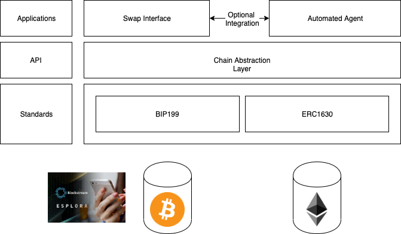

## Architecture

The approach taken by liquality is focussed on developing interoperability as a common language which favours standards over further intermediation through additional components and/or third-party blockchain middleware. 

Standards currently developed for interoperability include a slightly revised version of [Bitcoin Improvement Proposal 199](https://github.com/bitcoin/bips/blob/master/bip-0199.mediawiki) and a compatibility standards for Etheream called the [Ethereum Improvement Proposal 1630](https://github.com/ethereum/EIPs/issues/1631). 

These standards implement a common language for executing cross-chain atomic swaps between bitcoin, ether, and ERC20 tokens, and extending support for additional digital assets which support [sha256 hashlocks](https://en.bitcoin.it/wiki/Hashlock) and [timelocks](https://en.bitcoin.it/wiki/Timelock). 

The below figure shows a high-level overview of the liquality stack architecture. 

The liquality stack is licensed under the [MIT License](https://github.com/liquality/chainabstractionlayer/blob/dev/LICENSE.md), and is a completely free and open source community project. Each component developed or considered in the stack aims to ensure that you can run and customize your own instance without any dependency on a third-party. 