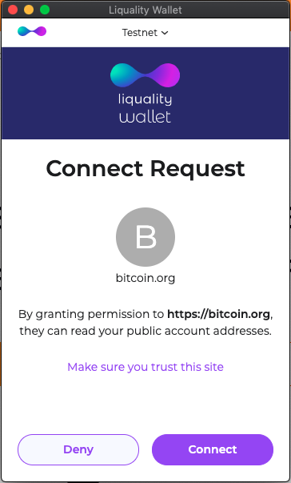

# Getting Started

Download the [Liquality Wallet](https://chrome.google.com/webstore/detail/liquality-wallet/kpfopkelmapcoipemfendmdcghnegimn?hl=en).

## Connecting with the extension

The extension injects the api into pages under `window.liquid`. 

To check that the extension is running and accessible on your web application, log the `window.liquid` object.

```js
> console.log(window.liquid)
{ enable: ƒ, request: ƒ }
```

As shown, the liquid interface exposes 2 very simple functions.

## Enable

Applications that need access to the wallet must first request that the extension is enabled. 

```js
> await window.liquid.enable()
```

This will prompt the user to allow access to the wallet for the application.



If the prompt is accepted, the first address of the user wallet will be returned. This can be used as a form of identity.

```js
[
  {
    "address": "el1qqd6q3nsyzj6pvdudqesjuw2v3ehxmu660y7ap7gp7zaaqn2df5qmdlmg6g6adt8r8sysxwn6s7m4hm2q83j0jha6v4hlq4755",
    "blindingPrivateKey": "68ac4860741786b421a6ea91b3fdc77468b04ac014ec4f1e33018e9a7a9fdcc1",
    "derivationPath": "84'/1'/0'/0/0",
    "publicKey": "03269f25419716fa284c02f8186136f79b623a59edecd92c487bdfb1dfbdc6a4c8",
    "index": 0
  }
]
```

The application can then make further requests to the wallet using `window.liquid.request()`

## Request

The `request` method is used to request information from the wallet (e.g. addresses, public keys) as well as prompt for signatures.

For example: We can retrieve 10 addresses using the `wallet_getAddresses` method:

```js
> await liquid.request({ method: 'wallet_getAddresses', params: [0, 10] })
[
  {address: "el1qqd6q3nsyzj6pvdudqesjuw2v3ehxmu660y7ap7gp7zaaqn2df5qmdlmg6g6adt8r8sysxwn6s7m4hm2q83j0jha6v4hlq4755", blindingPrivateKey: "68ac4860741786b421a6ea91b3fdc77468b04ac014ec4f1e33018e9a7a9fdcc1", derivationPath: "84'/1'/0'/0/0", publicKey: {…}, index: 0}
  {address: "...", blindingPrivateKey: "...", derivationPath: "84'/1'/0'/0/1", publicKey: {…}, index: 1}
  {address: "...", blindingPrivateKey: "...", derivationPath: "84'/1'/0'/0/2", publicKey: {…}, index: 2}
  {address: "...", blindingPrivateKey: "...", derivationPath: "84'/1'/0'/0/3", publicKey: {…}, index: 3}
  {address: "...", blindingPrivateKey: "...", derivationPath: "84'/1'/0'/0/4", publicKey: {…}, index: 4}
  {address: "...", blindingPrivateKey: "...", derivationPath: "84'/1'/0'/0/5", publicKey: {…}, index: 5}
  {address: "...", blindingPrivateKey: "...", derivationPath: "84'/1'/0'/0/6", publicKey: {…}, index: 6}
  {address: "...", blindingPrivateKey: "...", derivationPath: "84'/1'/0'/0/7", publicKey: {…}, index: 7}
  {address: "...", blindingPrivateKey: "...", derivationPath: "84'/1'/0'/0/8", publicKey: {…}, index: 8}
  {address: "...", blindingPrivateKey: "...", derivationPath: "84'/1'/0'/0/9", publicKey: {…}, index: 9}
]
```

## Supported Requests

- [wallet_getConnectedNetwork](../wallet_get_connected_network)
- [wallet_getAddresses](../wallet_get_addresses)
- [wallet_signMessage](../wallet_sign_message)
- [wallet_sendTransaction](../wallet_send_transaction)
- [wallet_blindPSET](../wallet_blind_pset)
- [wallet_signPSET](../wallet_sign_pset)
